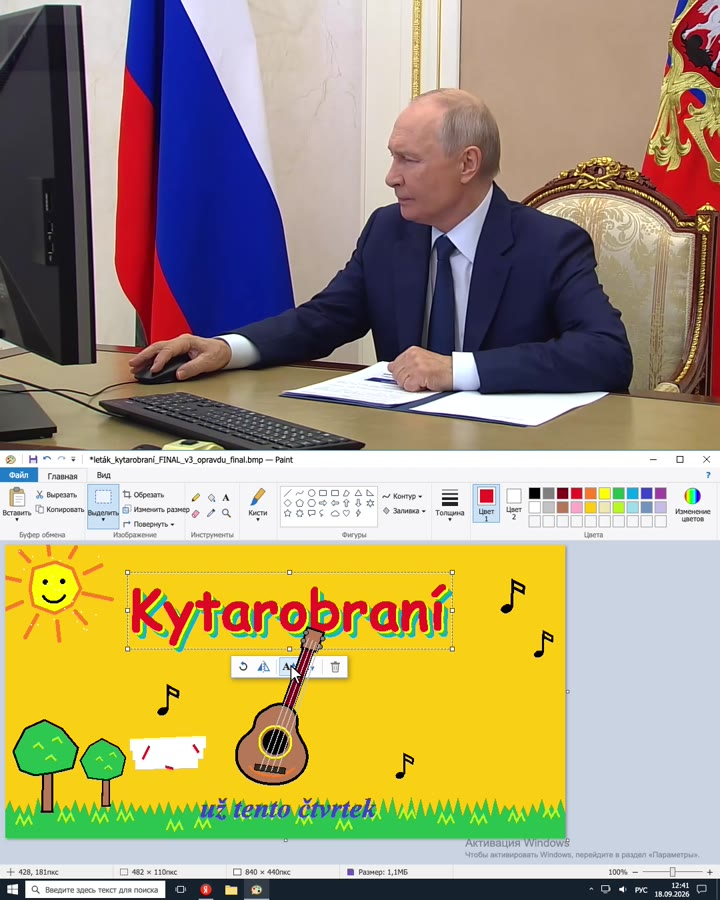
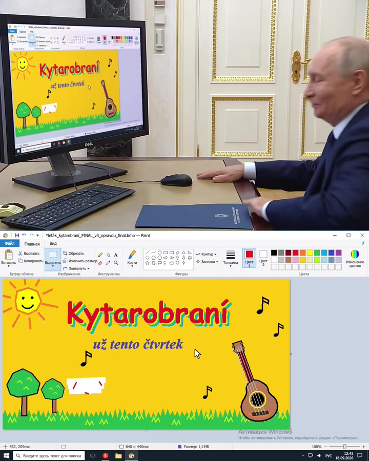

# putin-meme-click-sync

**Putin meme generátor: skill pro Claude Code, který vyrobí video „co ten Putin na tom počítači doopravdy dělá".**
Nahoře běží skutečný záběr z Kremlu (Putin 18. 9. 2026 „volí online"), dole falešná nahrávka jeho obrazovky – a kurzor
se v ní hýbe přesně tehdy, kdy se hýbe jeho ruka na myši, a kliká přesně na slyšitelné kliky z původního zvuku.
Co na té obrazovce dělá, je na vás.

*A Putin meme generator for Claude Code: real Kremlin footage on top, a fake recording of "his screen" below, with the
cursor frame-accurately synced to his real mouse hand and audible clicks. You decide what he is doing. The engine is
generic, so other footage works too. English docs: [`SKILL.md`](skills/putin-meme-click-sync/SKILL.md).*

<p>
  
  
</p>

Vzniklo to jako vtip: Putin 18. 9. 2026 „volil online" a na záběrech z Kremlu dlouho kliká myší, nakloní se až
k monitoru a nakonec spokojeně rozhodí ruce. V ukázce místo toho v Malování ladí příšerný leták na
[Kytarobraní](https://kytarobrani.cz). Celé to od nápadu po hotové video udělal Claude Code – a tenhle repozitář je
ten postup zabalený tak, aby si ho mohl pustit kdokoli s vlastním nápadem.

## Co je uvnitř

- **Změřený klip** `putin-vote-2026`: časy všech slyšitelných kliků, pohyb ruky snímek po snímku, popis „co kdy dělá",
  rohy jeho skutečného monitoru v posledním záběru, parametry pro odstranění loga televize. Video samotné v repu není,
  stáhne se při založení projektu.
- **Engine** (`template/engine.js`): vy napíšete, *kam* má kurzor jet; *kdy* a jak rychle jede, se vezme ze změřené
  rychlosti skutečné ruky. Kliky se věší na skutečné zvukové kliky; kde příběh potřebuje klik, který mikrofon nezachytil,
  přimíchá se klon jeho vlastního kliku.
- **Vzorová scéna** (`template/scene.js` + `screen.html`): falešné Malování v ruských Windows i s vodoznakem
  „Активация Windows", který tam ten den opravdu měl.
- **Nástroje**: detekce kliků ze zvuku, tracking ruky, hledání rohů monitoru, render přes headless Chromium, složení
  videa přes ffmpeg a hlavně **`verify_sync.py`**, který synchronizaci v hotovém souboru změří, místo aby se jen tvrdila.

## Instalace

Potřebujete [Claude Code](https://claude.com/claude-code), `ffmpeg`, `yt-dlp` a `python3` (macOS: `brew install ffmpeg yt-dlp`).

Jako plugin:
```
/plugin marketplace add motvicka/putin-meme-click-sync
/plugin install putin-meme-click-sync@motvicka
```
Nebo ručně jako osobní skill:
```bash
git clone https://github.com/motvicka/putin-meme-click-sync
cp -r putin-meme-click-sync/skills/putin-meme-click-sync ~/.claude/skills/
```

## Použití

V prázdné složce spusťte Claude Code a napište, co má dělat, třeba:

> Udělej mi meme s Putinem u počítače: dole ať hraje Miny a posledním klikem šlápne na minu.

Claude si přečte mapu klipu, navrhne vám scénář (čas → co dělá on → co se děje na obrazovce), postaví falešnou
obrazovku, vyrenderuje, složí video a nakonec vypíše naměřenou synchronizaci, např.:

```
frames OK; worst click offset 13 ms (one frame = 42 ms); 0 event(s) without an audible transient
```

Skill prošel i „slepým" testem: čerstvý agent, který o původním projektu nic nevěděl, podle něj napoprvé vyrobil
*Piškvorky 95* (Putin si před výhrou dvěma kliky sníží obtížnost na „Pro děti (3+)") a kontrola synchronizace prošla.

S vlastním videem to jde taky – postup měření je v [`references/new-clip.md`](skills/putin-meme-click-sync/references/new-clip.md).
Hotové „balíčky" dalších klipů rád přijmu jako PR.

## Jak to funguje (krátce)

1. **Kliky ze zvuku.** Klik myši je ~2 ms širokopásmové lupnutí. Po odfiltrování všeho pod 6 kHz vyčnívá nad řeč i šum
   místnosti, i když ho uchem skoro neslyšíte. Dva vrcholy 80–250 ms od sebe = stisk a puštění.
2. **Ruka z obrazu.** Šablona ruky s myší se hledá v každém snímku (normalizovaná korelace, sub-pixelově). Dává absolutní
   polohu bez driftu s přesností ~0,1 px; pro každou pozici těla (sedí / nakloněný k monitoru) je vlastní šablona.
3. **Scénář se píše kolem dat, ne naopak.** Každý hlasitý klik musí mít na obrazovce následek, kurzor smí jet jen když
   jede ruka, a poslední klik před spokojeným gestem musí práci dokončit.
4. **Tempo z ruky.** Uvnitř každého pohybu postupuje kurzor podle toho, jaký díl dráhy už urazila skutečná ruka – zdědí
   každé zaváhání a cuknutí. Přetažení „moc daleko a kousek zpátky" jsou jeho skutečné pohyby.
5. **Logo televize** se neodmazává, ale *odmíchá*: je to poloprůhledný box, takže se z rovnice `vidím = skutečnost·(1−a) + barva·a`
   dopočítá původní obraz. Jen neprůhledná písmena se doplní interpolací podél rovných hran monitoru.
6. **Pointa na jeho monitoru.** V posledním záběru je vidět skutečný monitor; hotová obrazovka se na něj perspektivně
   napasuje a nasvítí se mapou jasu získanou z původní (bílé) stránky, takže zdědí barevný nádech i odlesky kamery.
7. **Měření místo dojmu.** `verify_sync.py` spáruje snímky hotového videa se zdrojem a změří odstup každého kliku od
   zvuku v hotovém souboru.

## Pozn.

Je to satira. Nedělejte s tím falešné obrazovky, které by se daly vydávat za skutečné dokumenty, hlasovací lístky,
bankovnictví apod. Kód, šablony a naměřená data jsou pod MIT licencí; na stahované záběry třetích stran se nevztahuje.
